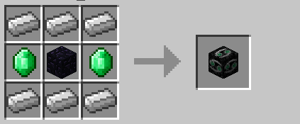
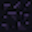
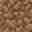

# Blink - Teleportation mod for Minecraft

## Overview

This mod allows you to build "Runes", which are 5x5x1 blocks of obsidian. You then create a signature for the Rune, which binds it to other Runes with the same signature.

## Blocks

This mod adds a single block: The Rune Core.

### Rune Core

The Rune Core is the primary component of a Rune. It stores the energy for the Rune and controls transmission and retrieval of Entities.

#### Recipe:

## Items

This mod does not add any new items.

## Structures

This mod adds a single structure: The Rune.

### Rune

Players construct the Rune and utilize it to teleport to other Runes with the same signature. A Rune is a 5x5x1 structure (horizontal). The following diagram outlines the structure of a Rune (note that the dirt blocks can actually be any material):

#### Recipe:

Runes are primarily constructed from Obsidian, with a Rune Core in the center. The Blocks immediately North, South, East and West of the Rune Core make up the Rune's signature.

The Signature components can be any block that you wish.

## Usage

To create a usable teleport, you will need to create two or more Runes with the same signature.

### Activation

Right clicking on the Rune Core of a completed Rune structure will activate the Rune. The Rune will draw energy from the surrounding environment, which you will observe as a lightning strike hitting the Rune.

If you do not see a Lightning strike when you attempt to activate the Rune, it means that the Rune is invalid. Check that your Rune structure matches the requirements defined above.

### Teleportation

Once you have constructed and activated two or more Runes with the same signature, you can teleport between them by right clicking the Rune Core in the center of the Rune.

When you use a Rune to teleport, you will be transported to the next Rune with the same signature. You will be transported to each Rune with the same signature in the same order that each Rune was activated.
